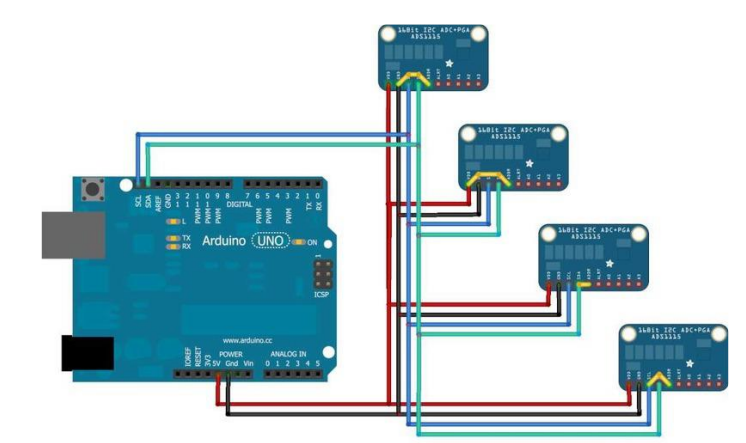

# Breakout Boards
(git push from powershell terminal)
## Boards

## Switches

## Sensors

- [FC-28 moisture (analog or digital)](#fc-28_moisture-(analog/digital))
- [ds18b20 1-wire temp](#ds18b20_1-wire-temp)
- [DHT11 / DHT22](#dht11-dht22_temp-hum)
- [Tactile Push Button Switch DIP](#tactile-push-button-switch-dip)

I2C
- [16 Bit I2C ADS1115 Module ADC 4 Channel with Pro Gain Amplifier](#ads115-4channel-16bit-adc-wamp)

SPI
- [MAX31856 Universal Thermocouple Amplifier](#max31856-universal-thermocouple-amplifier)

## Power
- [Yurobot power supply](#yurobot-power-supply)
- [Tiny 12V to 5V Buck Converter](#tiny-12v-to-5v-buck-converter)
## boards
XH-M203 Water Level Controller Board AC/DC 12V

## switches
### water level sensor

Maxmoral 2pcs Water Level Sensor DC 110V Side Mount Horizontal Liquid Float Switch for Aquarium Tank

## sensors

### FC-28_moisture-(analog/digital)
The analog output produces a value from 0-1023.

Can alternatively be used as a digital sensor. The module also contains a potentiometer, which will set the threshold value. This threshold value will be compared by the LM393 comparator. The output LED will light up and down according to this threshold value.

* Analog output (AO): This pin generates an analog signal and must be connected to an analog input of the microcontroller.
* Digital output (DO): This pin generates a digital signal and must be connected to a digital input of the microcontroller.
* VCC: Pin to supply power to the sensor (3.3 volts (V)-5 V).
* Ground (GND): Ground connection.

      "type": "se",
      "senses": "moisture",
      "model": "FC-28",
      "in": "A0" || "D*"

#### refs
* https://maker.pro/arduino/projects/arduino-soil-moisture-sensor

### ds18b20_1-wire-temp
The DS18B20 digital thermometer provides temperature measurements  The DS18B20 communicates
over a 1-Wire bus that by definition requires only one
data line (and ground) for communication with a central
microprocessor. 
Each DS18B20 has a unique 64-bit serial code, which
allows multiple DS18B20s to function on the same 1-Wire
bus. 

Config below shows an se and a cs sharing a 1-wire input.

    {
      "sr": 0,
      "type": "se",
      "senses": "temp"
      "model": "DS18B20", 
      "in": "D3",
      "reading": 68
    },
    {
      "sr": 1,
      "type": "cs",
      "senses": "temp"
      "model": "DS18B20", 
      "in": "D3",
      "out" "D4",
      "reading": 68,
      "onoff": 0,
      "hi": 69,
      "lo": 67
    }

#### refs
* [datasheet](https://www.analog.com/media/en/technical-documentation/data-sheets/ds18b20.pdf)
* https://docs.devicehive.com/v2.0/docs/ds18b20-and-esp8266
* [declaring array of sensors](https://forum.arduino.cc/t/solved-problem-declaring-an-array-of-dallas-temperature-sensors/307213/17)

### DHT11-DHT22_temp-hum
The DHT22 is the more costly model, but it offers superior characteristics. It has a temperature measurement range of -40°C to +125°C with +-0.5°C precision, whereas the DHT12 has a temperature range of -20°C to 60°C with +-0.5°C accuracy and the DHT11 has a temperature range of 0°C to 50°C with +-2 degrees accuracy. The DHT22 sensor also has a greater humidity measurement range, ranging from 0 to 100 percent with 2-5 percent accuracy, compared to the DHT12 humidity range of 20 to 95 percent with 5 percent accuracy and the DHT11 humidity range of 20 to 80 percent with 5 percent accuracy.

DHT11/22 uses an external approximately 10k pull up resistor, so that the state is high when the bus is idle.

    {
      "sr": 0,
      "type": "se",
      "senses": "temp-hum"
      "model": "DHT22", 
      "in": "D3",
      "reading": 68
    },
    {
      "sr": 1,
      "type": "cs",
      "senses": "temp-hum"
      "model": "DHT22", 
      "in": "D3",
      "out": "D4",
      "reading": 48,
      "onoff": 0,
      "hi": 90,
      "lo": 60
    },

* https://www.hnhcart.com/blogs/sensors-modules/dht11-vs-dht12-vs-dht22

## ADS115 4channel 16bit ADC wamp

The ADS1115 and ADS1015 [overview](https://learn.adafruit.com/adafruit-4-channel-adc-breakouts/overview), [pdf](https://cdn-learn.adafruit.com/downloads/pdf/adafruit-4-channel-adc-breakouts.pdf)4-channel breakout boards can run with power and logic signals between 2v to 5v, so they are compatible with all common 3.3v and 5v processors.  As many of 4 of these boards can be controlled from the same 2-wire I2C bus, giving you up to 16 single-ended or 8 differential channels.  A programmable gain amplifier provides up to x16 gain for small signals.

[pinouts](https://learn.adafruit.com/adafruit-4-channel-adc-breakouts/pinouts)

[ADS115-4channel-16ibt-ADC-wamp-LABEL](./ADS115-4channel-16ibt-ADC-wamp-LABEL.png)

- [Adafruit_ADS1X15 library for arduino](https://github.com/adafruit/Adafruit_ADS1X15)
- [datasheet](https://cdn-shop.adafruit.com/datasheets/ads1115.pdf)

      #include <Wire.h>
      #include <Adafruit_ADS1015.h>
      
      Adafruit_ADS1115 ads(0x48);
      
      void setup(void)
      {
      Serial.begin(9600);
      Serial.println("Hello!");
      
      Serial.println("Getting single-ended readings from AIN0..3");
      Serial.println("ADC Range: +/- 6.144V (1 bit = 3mV/ADS1015, 0.1875mV/ADS1115)");
      
      ads.begin();
      }
      
      void loop(void)
      {
      int16_t adc0, adc1, adc2, adc3;
      
      adc0 = ads.readADC_SingleEnded(0);
      adc1 = ads.readADC_SingleEnded(1);
      adc2 = ads.readADC_SingleEnded(2);
      adc3 = ads.readADC_SingleEnded(3);
      Serial.print("AIN0: ");
      Serial.println(adc0);
      Serial.print("AIN1: ");
      Serial.println(adc1);
      Serial.print("AIN2: ");
      Serial.println(adc2);
      Serial.print("AIN3: ");
      Serial.println(adc3);
      Serial.println(" ");
      
      delay(1000);
      }

## Tactile Push Button Switch DIP

Tactile Push Button Switch DIP-LABEL

-
-

-

### [Debouncing tutorial](https://www.e-tinkers.com/2021/05/the-simplest-button-debounce-solution/)

    bool debounce() {
      static uint16_t state = 0;
      state = (state<<1) | digitalRead(btn) | 0xfe00;
      return (state == 0xff00);
    }

A button connects between a GPIO pin and ground with internal resistor to INPUT_PULLUP so the GPIO pin remain HIGH when the button is not been pressed. 

      #define btn 2  //assuming we use D2 on Arduino

      void setup() {
        pinMode(btn, INPUT_PULLUP);
        pinMode(LED_BUILTIN, OUTPUT);
      }

      void loop() {
        if (debounce()) {
          digitalWrite(LED_BUILTIN, !digitalRead(LED_BUILTIN));
        }
      }

### [pull up resistor values](https://arduino.stackexchange.com/questions/49973/resistor-pull-ups-for-esp8266#:~:text=So%204.7k%2C%20under%20most%20general%20circumstances%2C%20is%20perfectly%20fine.)

10k is often chosen not because it's "better" than any other value, but purely because it's more common that many other values, and it's in the right kind of ball-park for most setups. It's low enough to give good noise immunity while being high enough to not cause undue current flow while the button is pressed. But more importantly, it's a resistor that everyone has in their kit, and is most likely the most common resistor used in a number of other places in the circuit as well. It's a good all-rounder as far as resistors go.

To take a closer look at the current flow aspect - if you are running (as with an ESP8266) at 3.3V and you have a 10k resistor the current flow, when the button is pressed and the resistor connected directly to ground, though the resistor would be (I=V/R) 3.3/10,000 = 330uA. If you used a 4.7k resistor (as you are doing at the moment) the current rises to 3.3/4,700 = 702uA. Yes, that's just over double the current, but twice peantus is still peanuts. So 4.7k, under most general circumstances, is perfectly fine.

However if power consumption is a real concern and you want to keep all consumption to an absolute minimum switching to 100k (as you often see in low-power circuits) would be beneficial, since 3.3/100,000 is 33uA.

If your input is connected to a momentary button which will be pressed for fractions of a second at a time it's not that much of an issue. But if the input is connected to a switch that could be activated for days or weeks at a time it obviously becomes of greater interest.

So in short: when running on batteries higher value pullup resistors are better, but when running off a power supply it really makes no difference.

## MAX31856 Universal Thermocouple Amplifier 
(I don't have these)

The [MAX31856](https://learn.adafruit.com/adafruit-max31856-thermocouple-amplifier) Thermocouple amplifier/converter that can handle just about any type of thermocouple. This converter communicates over 4-wire SPI and can interface with any K, J, N, R, S, T, E, or B type thermocouple

## MAX31855 Thermocouple Amplifier 

The [MAX31856](https://learn.adafruit.com/adafruit-max31856-thermocouple-amplifier) Thermocouple amplifier/converter for K-type thermocouple. This converter communicates over 4-wire SPI. 

## Tiny 12V to 5V Buck Converter

## Yurobot power supply
work fine off usb, not off 5v terminals

* Name: MB102 Breadboard Power Supply Module, Compatible with 3.3V, 5V
* Input Voltage: DC 6.5-12V or USB power supply; 
* Output Voltage: 3.3V, 5V Switchable; 
* Max Output Current: 700mA
* Two way independent control, can be switched to 0V, 3.3V, 5V
* On-board Two sets of 3.3V, 5V DC output pins, Facilitate the external leads.
* There is a green LED to indicate the presence of power, and an ON / OFF latching switch to control the power to the board.

## 5A DC 9,12,24 to 5v Buck Converter

Specification:

* Input Voltage: 9V- 36V
* Output Voltage: 5-5.3V
* Output Power When Input Different Voltage:
  * DC 9-24V, output 5.2V/6A/30W
  * DC 24-32V, output 5.2V/5A/25W
  * DC 32-36V, output 5.2V/3.5A/18W
Dimension: 63×27×10mm (L× W × H)